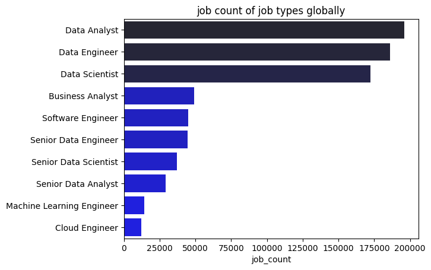
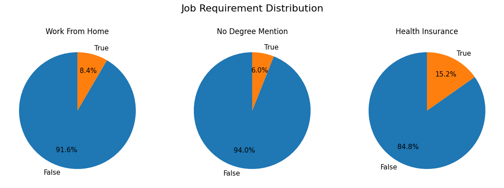
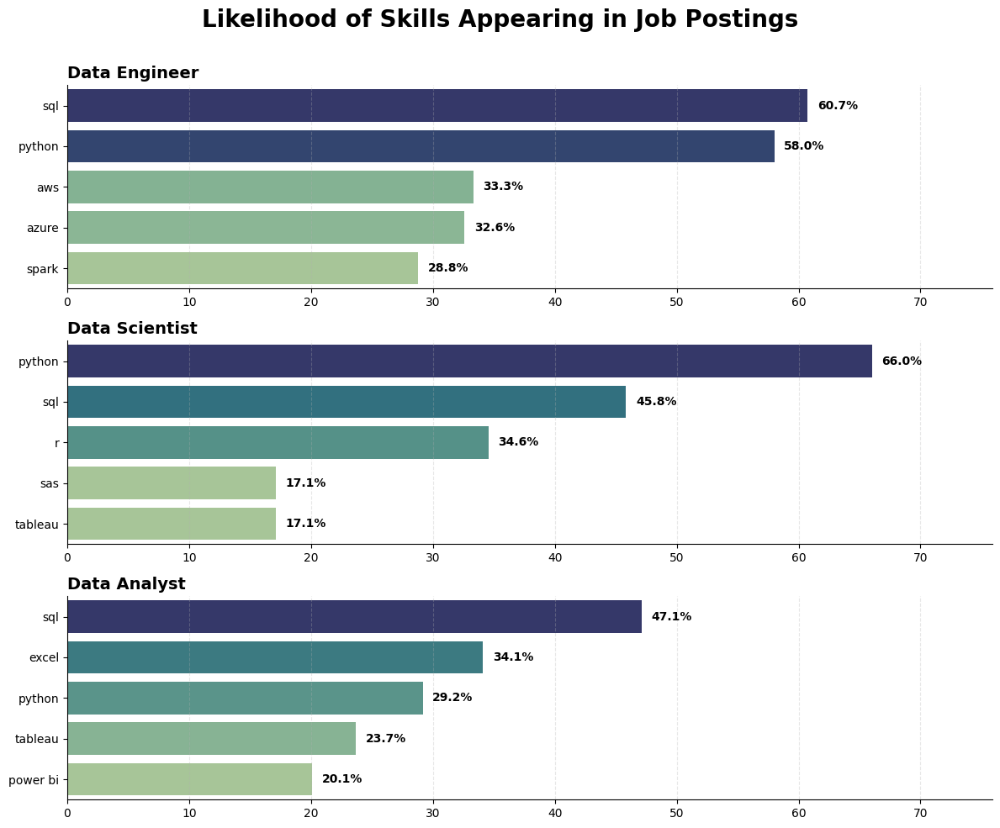
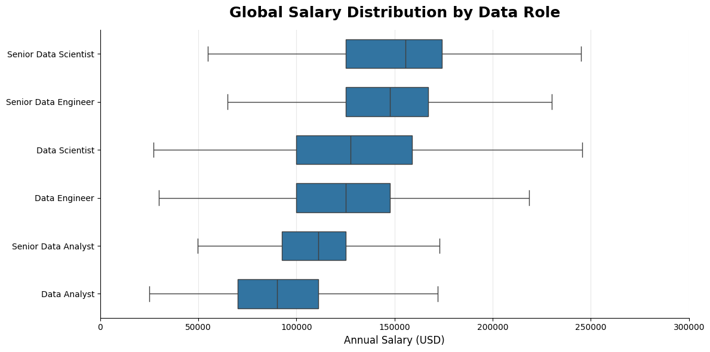
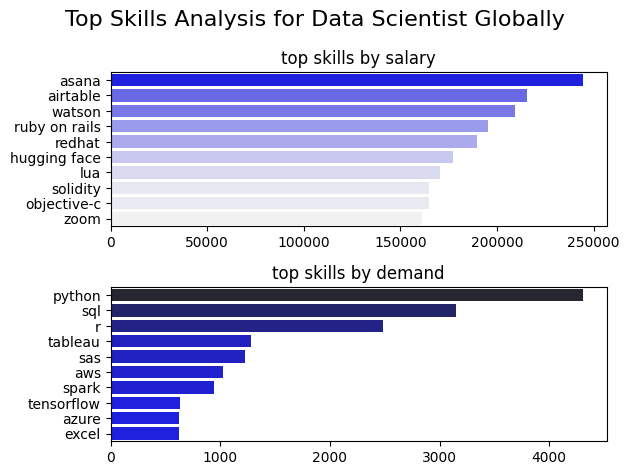
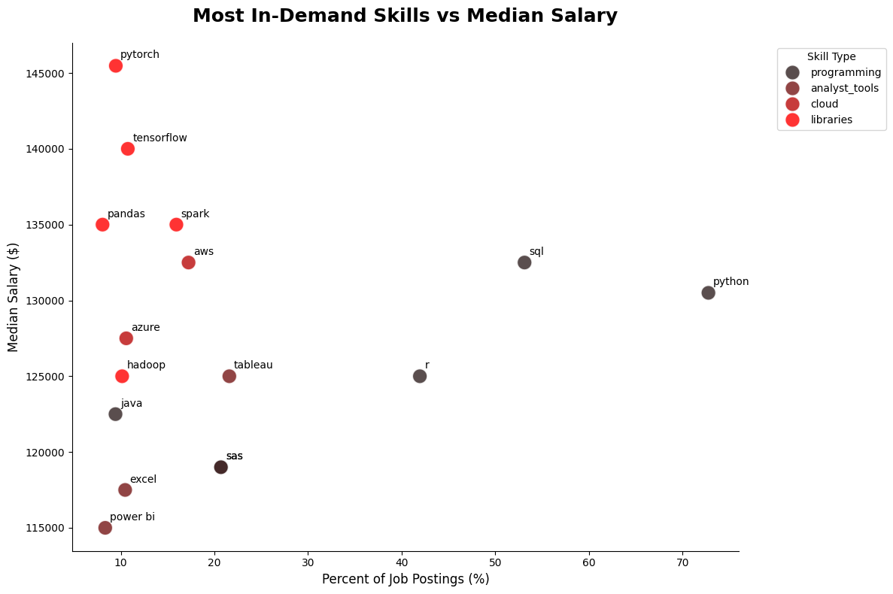
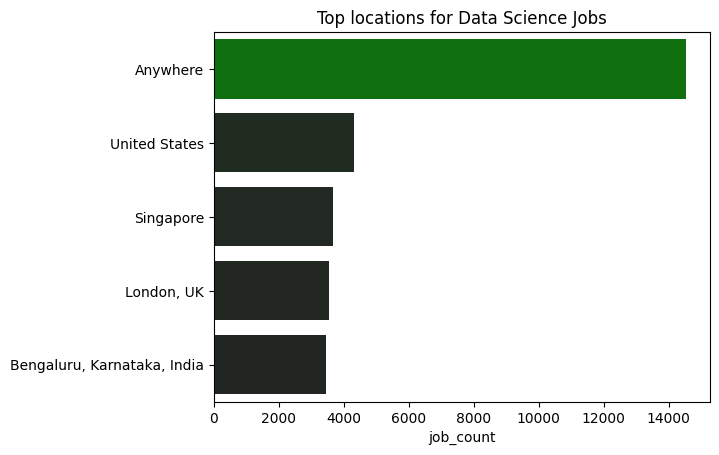
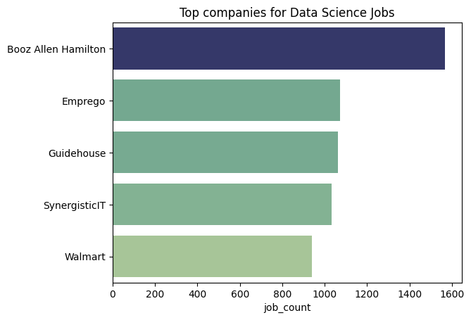

# 📊 Data Scientist Job Market Analysis

### Exploring Global Data Science Careers Through Python, Visualization, and Real-World Job Market Data

---

## 📑 Table of Contents

- [Overview](#-overview)
- [Executive Summary](#-executive-summary)
- [Business Questions](#-business-questions)
- [Tools Used](#-tools-used)
- [Project Notebooks](#-project-notebooks)
- [Dataset Overview](#-dataset-overview)
- [Job Market Overview](#-job-market-overview)
- [Skill Demand Analysis](#-skill-demand-analysis)
- [Skill Trend Analysis](#-skill-trend-analysis)
- [Salary Analysis](#-salary-analysis)
- [Highest Paying vs Most Demanded Skills](#-highest-paying-vs-most-demanded-skills)
- [Optimal Skills Analysis](#-optimal-skills-analysis)
- [Location and Employer Insights](#-location-and-employer-insights)
- [Key Takeaways](#-key-takeaways)
- [What I Learned](#-what-i-learned)
- [Future Improvements](#-future-improvements)
- [Acknowledgements](#-acknowledgements)

---

# 📖 Overview

Choosing which technologies to learn is one of the biggest challenges for aspiring data professionals.

Job postings often mention dozens of tools, frameworks, and platforms, but not every skill has the same market value. Some skills are required across nearly every role, while others appear less often but command a salary premium because they are more specialized.

The goal of this project was to answer a practical career question:

> **Which skills should an aspiring Data Scientist focus on to maximize both employability and earning potential?**

Using Python and real-world job posting data, I analyzed:

- Skill demand across major data careers
- Monthly trends in data science technologies
- Salary distributions across data roles
- The relationship between demand and compensation
- High-value skills worth investing time in

---

# 🎯 Executive Summary

This analysis shows that the data job market rewards a combination of broad foundation skills and targeted specialization.

- **SQL** appears across all major data roles and remains one of the safest skills to learn first.
- **Python** is the most important technical language for data science and data engineering.
- **Data Engineers** often earn salaries comparable to Data Scientists, especially when cloud and infrastructure expertise is involved.
- **Niche AI and machine learning tools** can pay very well, but they appear in fewer postings and are therefore harder to rely on alone.
- The strongest career strategy is not to chase trends blindly, but to build a **foundation in SQL and Python**, then layer on analytics, cloud, and ML skills based on your target role.

This project is designed to help students and early-career professionals make more informed learning decisions using actual job market patterns rather than guesswork.

---

# 🎯 Business Questions

This project answers the following questions:

1. Which skills are most demanded across Data Analyst, Data Scientist, and Data Engineer roles?
2. How do Data Science skill requirements change throughout the year?
3. Which data careers offer the highest compensation?
4. Are the highest-paying skills also the most demanded?
5. Which technologies provide the best balance between salary and demand?

---

# 🛠️ Tools Used

### Programming
- Python

### Data Analysis
- Pandas

### Data Visualization
- Matplotlib
- Seaborn

### Development Environment
- Jupyter Notebook
- Visual Studio Code

### Version Control
- Git
- GitHub

---

# 📚 Project Notebooks

| Notebook | Description |
| --- | --- |
| `EDA.ipynb` | Exploratory Data Analysis |
| `skills_demanded.ipynb` | Skill Demand Analysis |
| `skills_trend.ipynb` | Skill Trend Analysis |
| `salary_analysis.ipynb` | Salary Analysis |
| `optimal_skills.ipynb` | Optimal Skills Analysis |

---

# 📦 Dataset Overview

| Metric | Details |
| --- | --- |
| Source | Luke Barousse Data Jobs dataset |
| Scope | Global job postings |
| Roles Covered | Data Analyst, Data Scientist, Data Engineer, Senior Data Scientist, and related data roles |
| Main Variables | Job title, salary, location, skills, and job requirements |

The dataset provides a realistic view of how employers describe data roles in the market and which skills appear most often in job descriptions.

---

# 📊 Job Market Overview

Before looking at skills, it helps to understand the structure of the job market itself.

  

  <em>Figure 1. Overall job posting volume in the dataset.</em>

  

  <em>Figure 2. Common hiring requirements and job description patterns.</em>

## Why This Matters

This overview shows that the data market is not just about one job title. It includes a mix of analyst, scientist, engineering, and senior-level roles with different expectations.

That means a learning strategy should be role-aware:

- Analysts should focus on reporting, SQL, and BI tools
- Scientists should combine Python, SQL, statistics, and ML
- Engineers should prioritize SQL, Python, cloud platforms, and distributed systems

---

# 📈 Skill Demand Analysis

Understanding which skills employers request most frequently provides a roadmap for aspiring data professionals.

  

  <em>Figure 4. Likelihood of skills appearing in job postings for Data Analysts, Data Scientists, and Data Engineers.</em>

## Key Insights

### Data Analysts
Most requested skills:

- SQL (47.1%)
- Excel (34.1%)
- Python (29.2%)
- Tableau (23.7%)
- Power BI (20.1%)

### Data Scientists
Most requested skills:

- Python (66%)
- SQL (45.8%)
- R (34.6%)
- SAS (17.1%)
- Tableau (17.1%)

### Data Engineers
Most requested skills:

- SQL (60.7%)
- Python (58%)
- AWS (33.3%)
- Azure (32.6%)
- Spark (28.8%)

## What This Means

The chart reveals a clear pattern:

- SQL is the universal language of data.
- Python becomes more important as the role becomes more technical.
- Data engineering increasingly depends on cloud and distributed systems.
- Data analyst roles still rely heavily on spreadsheets, reporting, and dashboarding.

## Real-World Interpretation

If someone is starting from zero, the best path is usually:

1. Learn SQL first
2. Learn Python second
3. Add specialization afterward based on the role they want

That sequence gives the best balance of flexibility, employability, and long-term career growth.

---

# 📅 Skill Trend Analysis

Technology trends change rapidly, but foundational skills often remain valuable for years.

  

  <em>Figure 5. Monthly demand trends for the most requested Data Science skills.</em>

## Key Insights

### Python Remains Dominant
Python consistently appears in over 60% of Data Science job postings throughout the year.

Its dominance comes from its versatility across:

- Machine Learning
- Artificial Intelligence
- Data Analysis
- Automation

### SQL Shows Remarkable Stability
SQL remains one of the most consistently requested skills throughout the year, highlighting the importance of database management and structured data.

### R Maintains Relevance
Despite Python's dominance, R continues to appear in approximately one-third of Data Science postings, especially in research and statistical environments.

## What This Means

The trend chart suggests that core skills are far more stable than most new tools.

Instead of constantly chasing the latest framework, the better investment is to build strong foundations in:

- SQL
- Python
- Statistics
- Data handling
- Visualization

Those skills retain value across roles and across time.

---

# 💰 Salary Analysis

Demand is only one side of the equation. Understanding compensation helps identify which career paths offer the strongest financial opportunities.

  

  <em>Figure 6. Salary distribution across major data careers.</em>

## Key Insights

### Senior Data Scientists Earn the Highest Salaries
Senior Data Scientists show the highest median salaries and the greatest earning potential.

### Data Engineers Are Extremely Competitive
Data Engineers earn salaries comparable to Data Scientists, emphasizing the growing value of cloud and infrastructure expertise.

### Data Analysts Have Lower Salary Ceilings
Although Data Analysts remain essential to organizations, compensation tends to be lower than more technical and specialized roles.

## What This Means

Salary growth is not only about the title; it is also about the type of work.

Roles that involve:

- machine learning
- cloud infrastructure
- pipeline engineering
- advanced analytics

tend to have stronger compensation potential than roles focused mainly on reporting.

---

# 🚀 Highest Paying vs Most Demanded Skills

One of the most interesting findings from the project was that the most demanded skills are not necessarily the highest paying.

  

  <em>Figure 7. Comparison of the highest-paying and most demanded Data Science skills.</em>

## Most Demanded Skills

- Python
- SQL
- R
- Tableau
- SAS

## Highest Paying Skills

- Asana
- Airtable
- Watson
- Ruby on Rails
- Hugging Face

## What This Means

This chart shows a real trade-off:

- **Broad skills** create more job opportunities.
- **Specialized skills** can produce a salary premium.

Mainstream tools like Python and SQL are easier to justify as core career investments because they show up across many roles. Specialized tools may pay more, but they usually appear in fewer postings and can be harder to rely on as a primary strategy.

## Career Strategy

### Maximize Employability
Focus on:

- Python
- SQL
- Tableau
- R

### Maximize Compensation
Specialize in:

- Hugging Face
- Watson
- Ruby on Rails

The strongest professionals combine both approaches: a solid foundation plus one or two high-value specializations.

---

# 🎯 Optimal Skills Analysis

The final analysis combines demand and salary data to identify the technologies offering the best overall return on investment.

  

  <em>Figure 8. Skills that balance both demand and compensation.</em>

## Key Insights

### Python Is the Clear Winner
Python combines:

- High demand
- Strong salaries
- Broad applicability

No other technology offers a better overall balance.

### SQL Remains Essential
SQL appears in more than half of job postings while maintaining strong compensation.

### Machine Learning Skills Command Premium Salaries
Technologies such as:

- TensorFlow
- PyTorch

appear less frequently but offer some of the highest salaries.

### Cloud Skills Continue to Grow
AWS and Azure provide strong salary potential while remaining highly relevant across industries.

## Recommended Learning Roadmap

### Phase 1: Foundation
- SQL
- Python

### Phase 2: Analytics
- Tableau
- Power BI
- R

### Phase 3: Specialization
- TensorFlow
- PyTorch
- AWS
- Azure
- Spark

This progression gives the best balance between employability and long-term earning potential.

---

# 🌍 Location and Employer Insights

The dataset also reveals where the strongest hiring activity is happening and which companies are most active in the data market.

  

  <em>Figure 9. Top hiring locations for data science jobs.</em>

  

  <em>Figure 10. Top hiring companies for data science jobs.</em>

## Why This Matters

This is useful for job seekers because it helps turn a broad market into a focused search strategy.

Instead of applying everywhere at random, you can target:

- regions with stronger hiring volume
- employers that hire repeatedly for data roles
- markets where your skills are most likely to be valued

This makes the job search more efficient and more realistic.

---

# 🔑 Key Takeaways

After analyzing the job market data, five clear patterns emerged:

### 1. SQL Is Non-Negotiable
SQL appears across every major data profession and remains one of the safest skills to invest in.

### 2. Python Dominates Data Science
Python consistently appears as the most requested skill and offers one of the strongest salary-to-demand ratios.

### 3. Data Engineering Is Underrated
Data Engineers earn salaries comparable to Data Scientists while benefiting from growing demand for cloud expertise.

### 4. Niche Skills Command Premium Salaries
Technologies such as Hugging Face, Watson, and Airtable appear less frequently but offer significantly higher compensation.

### 5. Fundamentals Outperform Trends
Mastering Python and SQL provides a stronger long-term return than constantly chasing new frameworks.

---

# 📖 What I Learned

This project strengthened my skills in:

### Data Analysis
- Exploratory Data Analysis (EDA)
- Data Cleaning
- Data Transformation
- Statistical Analysis

### Python
- Pandas
- GroupBy Operations
- Pivot Tables
- Data Aggregation
- Explode Functions

### Data Visualization
- Bar Charts
- Line Charts
- Box Plots
- Scatter Plots
- Multi-Panel Dashboards

### Data Storytelling
The biggest lesson from this project was learning how to transform data into actionable insights.

Creating visualizations is only part of the process.

The real value comes from explaining what the data means and using it to support better decisions.

---

# 🚧 Future Improvements

Potential future enhancements include:

- Interactive dashboards using Plotly
- Salary prediction models
- Geographic salary analysis
- Remote vs On-site role comparisons
- Industry-specific skill analysis
- Forecasting future skill demand using machine learning

---

# 🙏 Acknowledgements

This project was inspired by and built using datasets provided through Luke Barousse's Python Data Analytics course.

The analysis, visualizations, insights, and recommendations presented here were independently developed as part of my data analytics learning journey.

---

### 👨‍💻 Duncan D'Lima

Aspiring Data Analyst • Data Science Enthusiast • Python Developer

